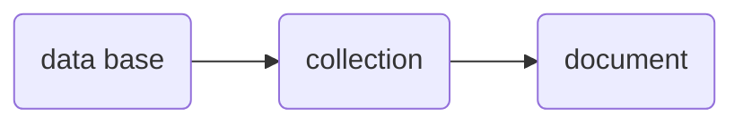

[TOC]


# Mongodb Aprendiendo 

Estaremos aprendiendo todo sobre mongo en la terminal 

## conceptos de Mongodb




- **Base de datos**:  Simplemente son los nombres de las bases de datos 
- **Colecciones**: Las colecciones son una agruptacion de **documentos**, es equivalente a una tabla de base de datos SQL 
- **Documentos**: Los documentos serian los registros de datos dentro  de las **colecciones** 

Para entender mejor, estos veanlo como padre, hijo, nietos 

```json
// un documento, un registro 
{
    name:"Pedro",
   	age:40,
    country:"Peru"
}

//una coleccion, un conjunto de documentos o de registros
"user":
[
    {
	  name:"Juan",
   	  age:50,
      country:"Peru"
	},
    {
      name:"Pedro",
   	  age:40,
      country:"Peru"
    }
]

```

## Comandos para shell

- Usar una base de datos

  ```mysql
  use  <nombre de base de datos>
  ```
  
- Crear una base de datos 

  ```mysql
  use newDatabase
  ```
  
- Ayuda sobre las shell

  ```mysql
  help
  #para ver algunas opciones de ayuda
  
  db.help() 
  #lista algunos Métodos que podemos
  ```

- Limpiar la consola

  ```bash
  cls
  ctrl + l
  ```

  

## Tipos de datos

- Tipos
  - Date
  - Objectld
  - NumberLong
  - NumberInt
  - NumberDecimal
- Check types in the mongo shell
  - Intancesof
  - Typeof


### Date

Hay varios métodos para devolver una fecha ya sea en string o en objeto 

```javascript
Date()  // Devuelve la fecha como cadena
new Date() 	//Constructor que devuelve la fecha como objeto utilizando el ISODate()
ISODate()
```

### Objectld

este tipo de dato nos proporciona un aid

```

```

comandos activar mongodb

```bash
sudo service mongod start
```

## Comandos en la shell

```shell
use db
show dbs
show collections
db.product.find() # listar los documentos de una collecion

```

